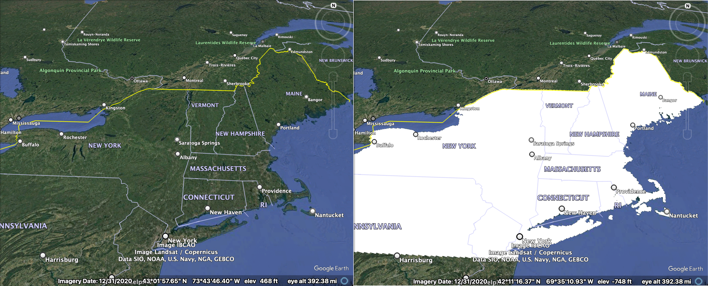

# Weather Microservice Demo
A microservice for weather API data ETL

## Replay
### Local TimescaleDB Setup
1. On macOS, run the following **globally** installations:
   1. Clean up. Run `cd ~ && ls /opt/homebrew/var | grep postgresql` to check what PostgreSQL versions you've probably already installed on your Mac. For each version, uninstall it by running `brew uninstall --force postgresql@16` and `rm -rf /opt/homebrew/var/postgresql@16`
   
   2. Use `brew` to install PostgreSQL 16.x (The highest version compatible with TimescaleDB). Download TimescaleDB from GitHub. Then build and install it with `make`
   ```zsh
   brew update
   brew install postgresql@16
   brew install cmake
   git clone https://github.com/timescale/timescaledb.git
   cd timescaledb
   git checkout $(git tag -l | grep -v '\-' | sort -V | tail -1)  # Get the latest stable release
   ```

   3. Get the output of `find /opt/homebrew -name pg_config` to locate the `pg_config` file path such as `/opt/homebrew/Cellar/postgresql@16/16.5/bin/pg_config`. Temporarily add it to your `$PATH` and by running `export PATH="/opt/homebrew/opt/postgresql@16.9/bin:$PATH"`
   
   4. Build and install `TimescaleDB`.
   ```zsh
   ./bootstrap
   cd ./build && make
   make install
   ```

   5. Run `ls -la $(brew --prefix postgresql@16)/share/postgresql@16/extension/timescaledb*`. You should be able to see `timescaledb.control` and some `.sql` files, indicating the `TimescaleDB` extension has been installed correctly.
   
   6. Find where the config file is by running `find $(brew --prefix)/var -name "postgresql.conf"`. In my case it was `/opt/homebrew/var/postgresql@16/postgresql.conf`.

   7. Run `nano $(brew --prefix postgresql@16)/var/postgresql@16/postgresql.conf` to make sure there is a line saying `shared_preload_libraries = 'timescaledb'`. If not, edit the value of `shared_preload_libraries` parameter to `'timescaledb'`.

   8. Restart PostgreSQL and ensure it's running.
   ```zsh
   brew services restart postgresql@16
   brew services list  # Confirm it’s running
   pg_ctl -D /opt/homebrew/var/postgresql@16 status  # Confirm it’s running again, with PID this time
   ```

   9. Configure language and region of PostgreSQL DB, and start PostgreSQL service one more time
   ```zsh
   initdb /opt/homebrew/var/postgresql@16 -E utf8  # The database cluster will be initialized with locale "en_US.UTF-8". The default text search configuration will be set to "english".
   ```

   10. Now, you're ready to spin up a TimescaleDB of your own.
   ```zsh
   psql postgres  # Enter psql
   CREATE DATABASE weather_db;  # Create your PostgreSQL database
   \c weather_db  # You are now connected to database "weather_db" as user "qijunfang".
   CREATE EXTENSION IF NOT EXISTS timescaledb;  # If output says "CREATE EXTENSION", it's a success!
   ```

   11. Test connection to Timescale DB.
   ```zsh
   SELECT extname, extversion FROM pg_extension WHERE extname = 'timescaledb';
      extname   | extversion
   -------------+------------
   timescaledb | 2.21.0-dev
   (1 row)
   ```


## Thought Processes
1. It is a 2-step process to get the weather forecasts according to [this](https://www.weather.gov/documentation/services-web-api)
   1. Step 1 is to inquire which [Gridpoint](https://weather-gov.github.io/api/gridpoints) (a 2.5km x 2.5km rectangle on the map of the United States represented by an office code consisting of 3 capital letters and two integers) a specific lat/lon is located in with a payload looking like `https://api.weather.gov/points/{latitude},{longitude}`
   2. Step 2 is to obtain the grid forecast for a `gridpoint`, use the `/points` endpoint to retrieve the current grid forecast endpoint by coordinates with a payload looking like `https://api.weather.gov/gridpoints/{office}/{gridX},{gridY}/forecast` and `https://api.weather.gov/gridpoints/{office}/{gridX},{gridY}/forecast/hourly`
2. Gridpoints WFO/x/y should not be considered static but won't be updated often according to these GitHub Q&A threads [[1](https://github.com/weather-gov/api/discussions/621),[2](https://github.com/weather-gov/api/discussions/746)]
3. Given bullet points 1-2, we decided to do the following:
   1. Create our own list of 2.5km x 2.5km grids that are almost identical to said `gridpoint`s to perfectly cover the entirety of contiguous US. There are approximately 1.26M to be exact; 
   2. Every month, for each centroid of the grid, make a "Step 1" API call to get which `gridpoint` the centroid, therefore the grid corresponds to (e.g. The 2.5km x 2.5km grid near Topeka, KS `[[-97.0799, 39.7451], [-97.0803, 39.7672], [-97.109, 39.7668], [-97.1085, 39.7448], [-97.0799, 39.7451]]` corresponds to Gridpoint `TOP/32,81`). Here are two examples showcasing how the grids indeed cover up the whole country.


   3. With all the API responses, we can set up an SCD2 lookup table on our own database to find out which Gridpoint a requested lat/lon belongs to. To pull such mapping offline, instead of making an API call each time a request comes in, we reduced latency and enhanced reliability.

## Project References
1. [National Weather Service API](https://www.weather.gov/documentation/services-web-api)
2. National Weather Service API [forecast update schedule](https://www.weather.gov/gid/nwr_general), hourly weather forecasts are updated every hour approximately 5 minutes after the top of the hour.
3. [U.S. States coordinate polygon data](https://www.census.gov/cgi-bin/geo/shapefiles/index.php?year=2024&layergroup=States+%28and+equivalent%29) from U.S. Census.
4. [pygris](https://walker-data.com/pygris/), a Python package to help users access US Census Bureau TIGER/Line and cartographic boundary shapefiles and load them into Python as GeoDataFrames.
5. [Google Earth Pro](https://www.google.com/earth/outreach/learn/importing-geographic-information-systems-gis-data-in-google-earth/) to visualize `.shp` files downloaded or you created yourself.
6. Web tool to [visualize WKT strings](https://wktmap.com/) of Geo-objects under various EPSG versions (namely, Coordinate Reference Systems (CRSs)). For example the two systems involved in the app are:
   1. EPSG:4326, also known as WGS 84, is a geodetic coordinate system representing latitude and longitude on the surface of the Earth.
   2. EPSG:5070 is a projected coordinate system, specifically the Albers Equal Area Conic projection for the contiguous United States, using the NAD 1983 datum.
   3. If you are a real geography nerd, check [this](https://gis.stackexchange.com/questions/378716/understanding-epsg-in-wkt) out.
7. Web tool to [stitch images](https://pinetools.com/merge-images).

## Ambitions / Improvement Opportunities