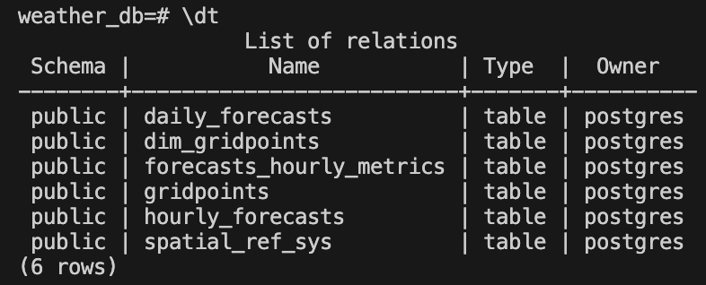
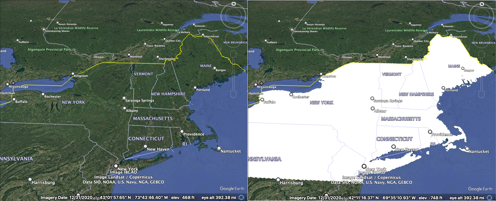

# Weather Microservice Demo
A microservice that fetches weather forecast of a requested (longitude, latitude) in the contiguous U.S. (48 states + D.C.) from Nationa Weather Service (NWS) API and performs ETL processes.


## 1. Results
First thing first, all tables ingested:
- [Sample](screenshots/Table_Sample_1_"gridpoints".txt) of table `gridpoints`
- [Sample](screenshots/Table_Sample_2_"dim_gridpoints".txt) of table `dim_gridpoints`
- [Sample](screenshots/Table_Sample_3_"daily_forecasts".txt) of table `daily_forecasts`
- [Sample](screenshots/Table_Sample_4_"hourly_forecasts".txt) of table `hourly_forecasts`
- [Sample](screenshots/Table_Sample_5_"forecasts_hourly_metrics") of table `forecasts_hourly_metrics`

## 2. Thought Process & Engineering Design
### 2.1 Choice of DB
We were given 4 candidate databases to consider: PostgreSQL, MongoDB, TimescaleDB, InfluxDB. TimescaleDB, **or more accurately speaking, a PostgreSQL DB with both TimescaleDB and PostGIS extensions was choosen**. Justifications are:
- TimescaleDB is built on PostgreSQL, giving you both powerful **time-series optimization** and full SQL capabilities, including window functions and moving averages calculation.
- Our data contains latitude/longitude coordinates. TimescaleDB with PostGIS extension provides excellent **geospatial functions** for calculating distances between coordinates, which was proven to be right in the data transformation step.
- It is mentioned that the scale of requests would be thousands of calculations per minute, indicating **high-throughput OLTP requirements**. TimescaleDB is designed to handle high write throughput while maintaining query performance.

In comparison, drawbacks of the other DBs are:
- <ins>PostgreSQL</ins>: Lacks time-series optimizations.
- <ins>MongoDB</ins>: NoSQL approach sacrifices the SQL window functionality.
- <ins>InfluxDB</ins>: Great for time-series but more limited SQL capabilities and less suited for mixed OLTP workloads.

### 2.2 Overview of ETL Process
1. The NWS website wants us to do a 2-step process to get the weather forecasts, according to [this](https://www.weather.gov/documentation/services-web-api)
   1. **Step 1**: Inquire which [Gridpoint](https://weather-gov.github.io/api/gridpoints) (a 2.5km x 2.5km rectangle on the map of the United States, denoted by 3 capital letters and two integers, e.g. "TOP/32,81") the requested lat/lon is located in, using URL `https://api.weather.gov/points/{latitude},{longitude}`
   2. **Step 2**: Obtain the daily/hourly grid forecast of a `gridpoint`, use the `points` endpoint to retrieve the current grid forecast endpoint by coordinates with URLs `https://api.weather.gov/gridpoints/{office}/{gridX},{gridY}/forecast` and `https://api.weather.gov/gridpoints/{office}/{gridX},{gridY}/forecast/hourly`
2. Meanwhile, we are reminded by NWS engineers that Gridpoints "WFO/x,y" should not be assumed static but won't be updated often, according to these GitHub Q&A threads [[1](https://github.com/weather-gov/api/discussions/621),[2](https://github.com/weather-gov/api/discussions/746)]
3. Given above facts, we decided to **build our own coordinates-to-gridpoint lookup table** with the following steps. The benefit is to pull such mapping "offline", instead of making one extra API call each time a request comes in, and hence to reduce latency and enhance reliability.
   1. Create our own collection of 2.5km x 2.5km grids perfectly cover the entirety of contiguous U.S. There are approximately 1.26 million of them, to be exact. Here are two examples showcasing how these grids together (zoom in you'll see white squares) indeed cover the whole country. I can't show the entire country covered by white squares without crashing Google Earth Pro<sup>TM</sup>.
*New England*
*East Massachusetts & Rhode Island*
   2. For each centroid of said self-built grids, make an API call against the `points` endpoint in "Step 1" to get which `gridpoint` the centroid corresponds to, then ingest into PostgreSQL database with postGIS extension. We have a coordinates-to-gridpoint lookup table.
   3. To ensure all entries in the lookup table are refreshed monthly, either do a whole round of 1.26 million API calls against the `points` endpoint every month, which takes about 96 hours to finish. Or, refresh 1/30 of the 1.26 million API calls (around 42,000) daily, which takes about 3.2 hours daily. Such scheduling shall be orchestrated by Airflow/Astronomer (not implemented in this repo).
   4. A SCD2 table of the coordinates-to-gridpoint lookup table should be created on our PostgreSQL database, in case we need historical data for troubleshooting (not implemented in this repo).
4. As an example, we receive a weather forecast request from Washington, KS at coordinate (39.746, -97.083). The microservice will initiate the following ETL procedure:
   1. Lookup the coordinates-to-gridpoint mapping table. **Get the grid whose centroid coordinate is closest to the requested coordinate** (39.746, -97.083). In this case it's a grid centered at Topeka, KS `[[-97.0799, 39.7451], [-97.0803, 39.7672], [-97.109, 39.7668], [-97.1085, 39.7448], [-97.0799, 39.7451]]`;
   2. The grid corresponds to NWS Gridpoint with an ID `TOP/32,81`.
   3. Retrieve the daily/hourly weather forecasts of NWS Gridpoint `TOP/32,81` from the `forecast` endpoint in "Step 2". That's the forecast of the requested coordinate (39.746, -97.083).
   4. Now that we have the forecast data and its NWS Gridpoint info, we can calculate the derived metrics mentioned in the assignment.


## 3. Replay
### 3.1 Run in a Docker container
1. Prerequisites
   - Install Docker and Docker Compose CLIs. Check if you have both CLIs by running `docker --version` and `docker-compose --version`. If not, refer to the [installation instructions](https://docs.docker.com/compose/install/). Also, ensure Docker has sufficient resources allocated (e.g., at least 2 CPUs and 4GB of memory). Adjust these settings in Docker Desktop under menu `Settings > Resources`.
   - (Optional) Install [Docker Desktop](https://docs.docker.com/desktop/setup/install/mac-install/) for a more interactive UI than CLIs.
   - Install Homebrew by running `/bin/bash -c "$(curl -fsSL https://raw.githubusercontent.com/Homebrew/install/HEAD/install.sh)"` and `brew --version` to verify installation.
   - (Optional for Local Testing) Install Python `brew install python@3.13` and `python3 --version` to verify installation.
   - (Optional for Local Testing) Install Poetry `curl -sSL https://install.python-poetry.org | python3 -` and `poetry --version` to verify installation.
2. Clone the working directory
   ```zsh
   git clone https://github.com/FangQijun/weather-microservice-demo.git
   cd weather-microservice-demo
   ```
3. An `.env` file is not tracked by Git for safety reason. Therefore you'll have to create a `.env` file in the root directory with `touch .env` with the following content, where the `UA-DOMAIN(-BACKUP)` and `UA-EMAIL(-BACKUP)` serve as substitute to National Weather Service (NWS) API key, of which you'd ne making API calls on behalf. You need two sets of User-Agent parameters just in case NWS API has rate limits on API calls from one single UA.
   ```zsh
   UA-DOMAIN=[Your_Organization].com
   UA-EMAIL=[Your_Name]@[Your_Organization].com
   UA-DOMAIN-BACKUP=[Your_Backup_Organization].com
   UA-EMAIL-BACKUP=[Your_Pseudonym]@[Your_Backup_Organization].com

   DB_HOST=timescaledb
   DB_PORT=5432
   DB_NAME=weather_db
   DB_USER=postgres
   DB_PASSWORD=postgres
   ```
4. (Optional for Local Testing, and time-consuming) Install Timescale DB locally: Follow the steps in Section `Local Testing: Local TimescaleDB Setup` of this `README` file below ↓.
5. (Optional but highly recommended) As mentioned, it takes the microservice around 96 hours to get the info of all NWS gridpoints. Alternatively, you can
   - Either simply place a sample file `gridpoints_contiguous_us_20250514T194841.tsv` under directory `./data/gridpoints_file` to move forward.
   - Or, the full TSV file (498MB) can be download [here](https://drive.google.com/file/d/18jA2dB_8H1zXSN-tJSI0w6ISF2fuVEVU/view?usp=drive_link).
6. At the project root directory,
   1. Run `docker-compose up` to start the Docker images. Or, run `docker-compose up --build` to rebuild the Docker images before starting the containers in case you made changes to `Dockerfile` or the code base, then to create and start the containers as defined in your `docker-compose.yml` file. The following will occurr in the order of...
      - A PostgreSQL image with both TimescaleDB & PostGIS extensions will be spun up. This is a precursor of our microservice.
      - The `weather-microservice` image will be spun up.
      - As defined in `Dockerfile`, `app/main.py` will be executed so that...
         - A table schema for gridpoints data will be initialized.
         - Connection to Timescale DB will be tested.
         - Make said 1.26 million API calls against the `points` endpoint to build the coordinates-to-gridpoint lookup table.
         - Create the coordinates-to-gridpoint lookup table `gridpoints` in PostgreSQL DB.
         - Data Normalization: A `dim_gridpoints` table will be created in PostgreSQL DB with the info such as identifier, polygon and centroid of unique NWS Gridpoints seen in lookup table `gridpoints`.
         - Mimick a scenario when one single weather forecast request comes in, and extract daily & hourly forecasts from the NWS API. Then load the request result in tables `daily_forecasts` and `hourly_forecasts`.
         - Since the 4 required "Derived Data Points" are all about hourly statistics, perform data transformation towards table `hourly_forecasts` with the 4 required statistics included. Then insert the results into table `forecasts_hourly_metrics`.
   2. (Optional) Open a second terminal tab in either `Terminal.app` or your coding GUI. Run `docker ps` to verify two services are running indeed - one says "weather-microservice-demo-app" and the other says "timescale/timescaledb-ha:pg16". If you had Docker Desktop installed, it'll show two active containers.
   3. (Optional) Run `docker exec -it weather-microservice bash` to enter the project root directory of the `weather-microservice` service, in case you need to play around or troubleshoot.
   4. (Optional) Run `docker exec -it timescale-db psql -U postgres -d weather_db` to log in the PostgreSQL DB `weather_db`, in case you need to run some SQL queries in it.
   5. (Optional) Run `docker logs weather-microservice` or `docker logs timescale-db` to look at the logs of the two services in case of troubleshooting.
   6. In the second terminal tab, run `docker-compose down` to stop all containers started by `docker-compose` and remove the stopped containers, networks, and default volumes to leave your system clean. Go back to the first terminal tab - you should see all Docker containers killed. If you had Docker Desktop installed, it'll say something like "The compose app is no longer running"

### (Optional) 3.2 Local Test: Local TimescaleDB Setup
On macOS, run the following installation steps **locally but globally**, namely on the `Terminal.app` of your Mac device, outside a Docker container, and outside a Poetry virtual env. It will be a dreary experience, and note that **YMMV regarding the file paths** mentioned depending on the installation path of your `Homebrew`.
1. Clean up. Run `cd ~ && ls /opt/homebrew/var | grep postgresql` to check what PostgreSQL versions you've probably already installed on your Mac. For each version, uninstall it by running `brew uninstall --force postgresql@16` and `rm -rf /opt/homebrew/var/postgresql@16`

2. Use `brew` to install PostgreSQL 16.x (The highest version compatible with TimescaleDB). Download TimescaleDB from GitHub. Then build and install it with `make`
```zsh
brew update
brew install postgresql@16
brew install cmake
git clone https://github.com/timescale/timescaledb.git
cd timescaledb
git checkout $(git tag -l | grep -v '\-' | sort -V | tail -1)  # Get the latest stable release
```

3. Get the output of `find /opt/homebrew -name pg_config` to locate the `pg_config` file path such as `/opt/homebrew/Cellar/postgresql@16/16.5/bin/pg_config`. Temporarily add it to your `$PATH` and by running `export PATH="/opt/homebrew/opt/postgresql@16.9/bin:$PATH"`

4. Build and install `TimescaleDB`.
```zsh
./bootstrap
cd ./build && make
make install
```

5. Run `ls -la $(brew --prefix postgresql@16)/share/postgresql@16/extension/timescaledb*`. You should be able to see `timescaledb.control` and some `.sql` files, indicating the `TimescaleDB` extension has been installed correctly.

6. Find where the config file is by running `find $(brew --prefix)/var -name "postgresql.conf"`. In my case it was `/opt/homebrew/var/postgresql@16/postgresql.conf`.

7. Run `nano $(brew --prefix postgresql@16)/var/postgresql@16/postgresql.conf` to make sure there is a line saying `shared_preload_libraries = 'timescaledb'`. If not, edit the value of `shared_preload_libraries` parameter to `'timescaledb'`.

8. Restart PostgreSQL and ensure it's running.
```zsh
brew services restart postgresql@16
brew services list  # Confirm it’s running
pg_ctl -D /opt/homebrew/var/postgresql@16 status  # Confirm it’s running again, with PID this time
```

9. Configure language and region of PostgreSQL DB, and start PostgreSQL service one more time
```zsh
initdb /opt/homebrew/var/postgresql@16 -E utf8  # The database cluster will be initialized with locale "en_US.UTF-8". The default text search configuration will be set to "english".
```

10. Now, you're ready to spin up a TimescaleDB of your own.
```zsh
psql postgres  # Enter psql
CREATE DATABASE weather_db;  # Create your PostgreSQL database
\c weather_db  # You are now connected to database "weather_db" as user "[your_mac_username]".
CREATE EXTENSION IF NOT EXISTS timescaledb;  # If output says "CREATE EXTENSION", it's a success!
```

11. Test existence of TimescaleDB extension.
```zsh
SELECT extname, extversion FROM pg_extension WHERE extname = 'timescaledb';
   extname   | extversion
-------------+------------
   timescaledb | 2.21.0-dev
(1 row)
```

12. Now, let's install PostGIS. Check where your `postgresql@16` is installed with `cd ~ && brew list postgresql@16`. You shoud see something saying `/opt/homebrew/Cellar/postgresql@16/16.9/bin/pg_config`. We will use this in Step 14.

13. Create an symbolic link of `postgresql@16`.
```zsh
sudo ln -s /opt/homebrew/Cellar/postgresql@16/16.9/bin/postgres /usr/local/bin/postgres
```

14. Download a version of PostGIS known to be compatible with `postgresql@16`. Use `cmake` to build and install it.
```zsh
cd~ && rm -rf postgis
curl -L https://download.osgeo.org/postgis/source/postgis-3.4.2.tar.gz -o postgis.tar.gz
tar -xzf postgis.tar.gz
cd postgis-3.4.2
./configure --with-pgconfig=/opt/homebrew/Cellar/postgresql@16/16.9/bin/pg_config  # Or whatever output from Step 12
make
make install
```

15. Verify PostGIS compatible with `postgresql@16` was installed successfully with `find /opt/homebrew -name postgis.control | grep postgresql@16`. You should get something like `/opt/homebrew/Cellar/postgresql@16/16.9/share/postgresql@16/extension/postgis.control`.

16. Now, PostGIS extension is ready in PostgreSQL.
```zsh
psql postgres  # Enter psql
\c weather_db  # You are now connected to database "weather_db" as user "[your_mac_username]".
CREATE EXTENSION IF NOT EXISTS postgis;  # If output says "CREATE EXTENSION", it's a success!
```

17. Test existence of PostGIS extension.
```zsh
SELECT extname, extversion FROM pg_extension WHERE extname = 'postgis';
   extname | extversion
---------+------------
   postgis | 3.4.2
(1 row)
```

### 3.3 (Optional) More Local Tests
To test the Timescale DB connection from a module
```zsh
python src/database/timescale_db_connection.py
```
To define the schemas for the gridpoints table
```zsh
python src/database/define_schemas.py
```
To import data in the TSV file into the gridpoints table. The app automatically finds the latest `.tsv` file (the greatest timestamp suffix) inside dir `./data/gridpoints_file` for ingestion.
To overwrite to table `gridpoints` with the entire TSV file (~1.26 million records), 1000 records per batch.
```zsh
python app/load/load_gridpoints.py --batch-size 1000
```
To overwrite to table `gridpoints` with the first 50,000 records of the TSV file, 1000 records per batch.
```zsh
python app/load/load_gridpoints.py --batch-size 1000 --num-rows 50000
```
To **append** to table `gridpoints` with the first 30,000 records of the TSV file, 1000 records per batch.
```zsh
python app/load/load_gridpoints.py --batch-size 1000 --num-rows 30000 --mode a
```


## 4. Ambitions / Improvement Opportunities
- For simplicity, there are only a database `weather_db` and a few tables created in TimescaleDB, but no schema was created for better data cataloging.
- Some tables in TimescaleDB (e.g. `gridpoints`) needs a SCD2 setup, but unfortunately I ran out of time.
- Forgot to adopt the naming convention of the Star Schema. For instance, table `gridpoints` really should be called `fact_coordinates_gridpoints` instead. When I realized it, I was too scared to make a change.
- As mentioned, with limited time, an Airflow/Astronomer server wasn't implemented for data task orchestration. It's a crucial component of ETL pipeline automation, after all.
- Deduplication of `forecast_` tables were done with a TimescaleDB SQL query in function `load_forecast_from_tsv()`, but it really needs to happen earlier on cache/application level to avoid DDoS attacks.
- With limited time, I didn't quite have a chance to implement unit and integration tests or configure a CI/CD pipeline
- Here, the data transformation was done with SQL queries wrapped by a Python script. It'd be more elegant to use a local **dbt server** with `dbt-core` CLI.
- Again, I didn't quite have a chance to defend my app against potential scalability issues
   - Some of the local staging filename has a static name. If multiple requests are received simultaneously, that staging file might be overwritten by the next request before the ETL process of the previous hasn't finished yet.
   - Step 1.1 & 1.2 in `./app/main.py` is slow. Takes days, but luckily this is a one-time execution as a kickstart of the microservice.

## 5. Project References
1. [National Weather Service API](https://www.weather.gov/documentation/services-web-api)
2. National Weather Service API [forecast update schedule](https://www.weather.gov/gid/nwr_general), hourly weather forecasts are updated every hour approximately 5 minutes after the top of the hour.
3. [U.S. States coordinate polygon data](https://www.census.gov/cgi-bin/geo/shapefiles/index.php?year=2024&layergroup=States+%28and+equivalent%29) from U.S. Census.
4. Latest Docker image of Timescale DB [[1](https://hub.docker.com/r/timescale/timescaledb-ha), [2](https://github.com/timescale/timescaledb-docker-ha/)].
5. [pygris](https://walker-data.com/pygris/), a Python package to help users access US Census Bureau TIGER/Line and cartographic boundary shapefiles and load them into Python as GeoDataFrames.
6. [Google Earth Pro<sup>TM</sup>](https://www.google.com/earth/outreach/learn/importing-geographic-information-systems-gis-data-in-google-earth/) to visualize `.shp` files downloaded or you created yourself.
7. Web tool to [visualize WKT strings](https://wktmap.com/) of Geo-objects under various EPSG versions (namely, Coordinate Reference Systems (CRSs)). For example the two systems involved in the app are:
   1. EPSG:4326, also known as WGS 84, is a geodetic coordinate system representing latitude and longitude on the surface of the Earth.
   2. EPSG:5070 is a projected coordinate system, specifically the Albers Equal Area Conic projection for the contiguous United States, using the NAD 1983 datum.
   3. If you are a real geography nerd, check [this](https://gis.stackexchange.com/questions/378716/understanding-epsg-in-wkt) out.
8. Web tool to [stitch images](https://pinetools.com/merge-images).
9. Web tool to [show file differences](https://www.diffchecker.com/text-compare/).
10. Pros and cons of PostGIS GEOGRAPHY and GEOMETRY types: [GEOGRAPHY vs GEOMETRY](https://gis.stackexchange.com/questions/6681/pros-and-cons-of-postgis-geography-and-geometry-types).